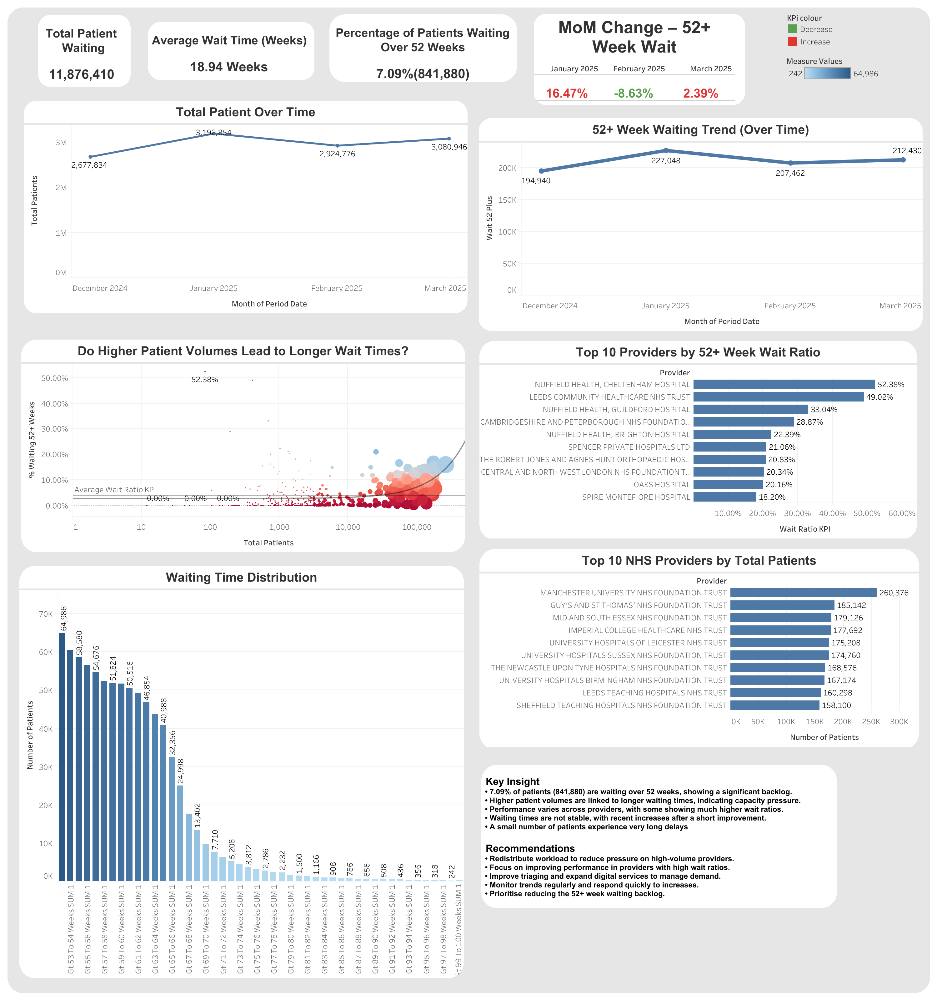

# Case Study: NHS Waiting Times Analysis | Delays, Demand & Capacity Insights


**Tools used:** Excel--Python--Tableau.


## Project Overview
This project analyses NHS waiting list data to understand the scale of long waiting times, identify the drivers of the **52+ week backlog**, and compare provider performance.

The goal is to uncover actionable insights that can support capacity planning, improve patient outcomes, and reduce long waiting times.

The analysis focuses on:

- Total patient volume and long-wait backlog  
- The percentage of patients waiting over 52 weeks  
- Monthly changes in waiting performance  
- Differences in provider performance  
- The relationship between patient volume and waiting times  
- The distribution of long waiting times across week bands  

---

## Table of Contents

1. [Business Problem](#business-problem)
2. [Dataset](#dataset)
3. [Tools Used](#tools-used)
4. [Data Cleaning in Python](#data-cleaning-in-python)
5. [Python Analysis](#python-analysis)
6. [Key Insights](#key-insights)
7. [Dashboard](#dashboard)

---

## Business Problem

NHS providers are under pressure from long patient waiting times, especially for patients waiting more than **52 weeks** for treatment.

This project aims to answer:

- How severe is the 52+ week backlog?  
- Are waiting times improving or worsening over time?  
- Which providers handle the highest patient volumes?  
- Which providers have the highest 52+ week wait ratios?  
- Do higher patient volumes lead to longer waits?  

### Why this matters

- Long waits can worsen patient outcomes and increase operational pressure  
- High-performing and low-performing providers can be compared to identify gaps  
- Leaders need clear evidence to decide where to increase capacity and focus support  

---

## Dataset

The dataset contains NHS waiting list data with fields such as:

- Provider  
- Period Date  
- Total Patients  
- Wait 52 Plus  
- Wait Ratio KPI  
- MoM % Change Wait 52 Plus  
- Week-band columns (Gt 52 to Gt 100 Weeks)  

These week-band columns were especially important because they allow analysis of long waiting-time distribution.

---

## Tools Used

| Tool | Purpose |
|------|--------|
| Python | Data cleaning, transformation, KPI calculations |
| Tableau | Dashboard development and data visualisation |
| GitHub Pages | Portfolio publishing |
| HTML/CSS | Project webpage design |

---

## 🧹 Data Cleaning in Python

Python was used to combine multiple monthly NHS files, clean the raw dataset, handle duplicates and missing values, convert numeric fields, and create the key **52+ week waiting metric**.

### 1. Load Data

```python
import pandas as pd

df = pd.read_csv("file.csv")

df.head()
df.shape
df.columns
```

---

### 2. Combine Multiple Files

```python
import os

folder = "data_folder"

all_files = [os.path.join(folder, f) for f in os.listdir(folder) if f.endswith(".csv")]
df_list = [pd.read_csv(file) for file in all_files]

combined_df = pd.concat(df_list, ignore_index=True)
```

---

### 3. Remove Duplicates

```python
clean_df = combined_df.copy()
clean_df = clean_df.drop_duplicates()
```

---

### 4. Convert Numeric Columns

```python
numeric_cols = [col for col in clean_df.columns if "SUM" in col or col == "Total"]

for col in numeric_cols:
    clean_df[col] = pd.to_numeric(clean_df[col], errors="coerce")
```

---

### 5. Filter Valid Data

```python
clean_df = clean_df.dropna(subset=[
    "Period",
    "Provider Org Name",
    "RTT Part Type",
    "Total"
])

clean_df = clean_df[clean_df["Total"] >= 0]
```

---

### 6. Create 52+ Week Metric

```python
long_wait_cols = [
    col for col in clean_df.columns
    if "Weeks" in col and col.startswith("Gt ") and int(col.split()[1]) >= 52
]

clean_df["wait_52_plus"] = clean_df[long_wait_cols].sum(axis=1)
```

---

## Python Analysis

### Percentage Waiting Over 52 Weeks

```python
percentage_long_wait = (
    clean_df["wait_52_plus"].sum() / clean_df["total_patients"].sum()
) * 100
```

---

### Monthly Trends

```python
trend = clean_df.groupby("period")["total_patients"].sum()
long_wait_trend = clean_df.groupby("period")["wait_52_plus"].sum()
```

---

### Provider Analysis

```python
provider_analysis = clean_df.groupby("provider").agg({
    "total_patients": "sum",
    "wait_52_plus": "sum"
}).reset_index()

provider_analysis["wait_ratio"] = (
    provider_analysis["wait_52_plus"] / provider_analysis["total_patients"]
)
```

---

## Key Insights

### 1. Backlog remains significant
Around **7.09% of patients (841,880 people)** are waiting over 52 weeks.

### 2. Higher volume leads to longer waits
Providers with higher patient volumes tend to experience longer waiting times.

### 3. Provider performance is uneven
Some providers perform significantly worse than others.

### 4. Progress is unstable
Monthly improvements are not consistent.

### 5. Long-tail waiting issue
A small group of patients experiences very long delays.

---


## Dashboard includes:

- Total patients and 52+ week KPIs  
- Monthly trends  
- Provider comparisons  
- Volume vs waiting time scatter plot  
- Waiting time distribution  
### Dashboard Preview


---

## Live Dashboard


[View the Interactive Dashboard](https://public.tableau.com/views/NHSWaitingListAnalysisDemandDelaysandCapacityPressure/NHSWaitingListPerformanceDashboard52WeekAnalysis?:language=en-GB&:sid=&:redirect=auth&:display_count=n&:origin=viz_share_link)
---

## Skills Demonstrated

Python | Data Cleaning | Data Analysis | KPI Development | Data Visualisation | Tableau | Problem Solving  

---

## Author

Jeewan Gurung  
LinkedIn: https://www.linkedin.com/in/jg936  
GitHub: https://github.com/jeewan-jg  
